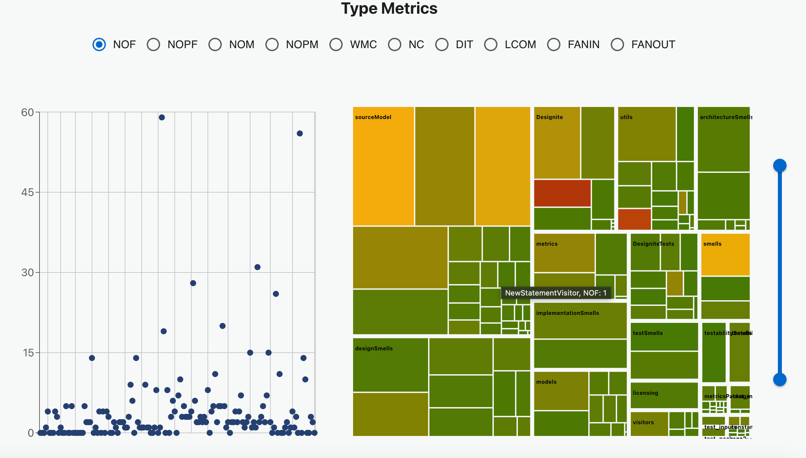

# DJ-Viz: Visualization for DesigniteJava analysis

The project aims to develop a web application for visualizing code smells and code quality metrics detected by the [DesigniteJava](https://designite-tools.com/products-dj) tool. DesigniteJava identifies various types of code smells in Java projects and generates CSV files containing detailed information about the detected smells. The web application provides a user-friendly interface to visualize the detected smells and computed code quality metrics.

## Features

- Supports visualizing detected code smells and computed code quality metrics by DesigniteJava.
- Supports two modes: _smells_ for visualizing DesigniteJava's analysis of a commit (typically the latest commit), _trend_ for visualizing DesigniteJava's analysis of a set of commits of a Java repository.





## Usage

Follow these steps to run the application using Docker:

### Prerequisites

1. **Run DesigniteJava for Analysis Files:** Before proceeding, ensure that you have run DesigniteJava to analyze your Java projects and generate the required files. Find more information about DesigniteJava and instructions to use the tool [here](https://designite-tools.com/products-dj).

2. **Check Docker Installation:** Docker should be installed on your machine.

### Running the application with Docker

1. Clone this repository and navigate to the project diretory.

2. Navigate to the folder where the `docker-compose.yml` file is located.

3. Run the following command in your terminal with appropriate folder path (that contains CSV files generated by DesigniteJava) with `TYPE="smells"`

   ```bash
   FOLDER="/absolute/path/of/smells/folder" TYPE="smells" docker-compose up
   ```

   For visualizing the trend data, invoke the command with `TYPE="trend"`. The provide folder should contain a `commits.txt` file containing the names of the subfolders (of the provided folder path) in each line. It is to provide the order of analysis results corresponding to each commit (each subfolder contains analysis result corresponding to a commit). For an example, refer to this <a href="./docs/sample.png">image</a>.

   ```bash
   FOLDER="/absolute_path/of/trend/folder" TYPE="trend" docker-compose up
   ```

   For the "trend" type, ensure that the folder contains subfolders that are named after the commit hashes that need to be analyzed.

4. Once the containers are up and running, open your web browser and go to [localhost:3000](http://localhost:3000) to access the application.

## Contributors

- <a href="https://github.com/kevinpanchal">Kevin Panchal</a>
- <a href="https://www.tusharma.in">Tushar Sharma</a>
